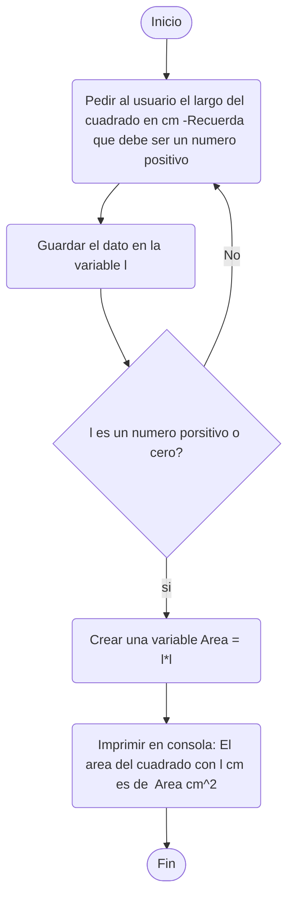

**_DIAGRAMA DE FLUJO EN MERMAID_**

```mermaid
flowchart TD

A([Inicio]) --> B
B(Pedir al usuario el largo del cuadrado en cm -Recuerda que debe ser un numero positivo) --> C
C(Guardar el dato en la variable l) --> D
D{l es un numero porsitivo o cero?} -->|si| E
E(Crear una variable Area = l*l) --> F
D --> |No| B
F(Imprimir en consola: El area del cuadrado con l cm es de  Area cm^2) --> G
G([Fin])
```

<!-- #imagen
 -->
